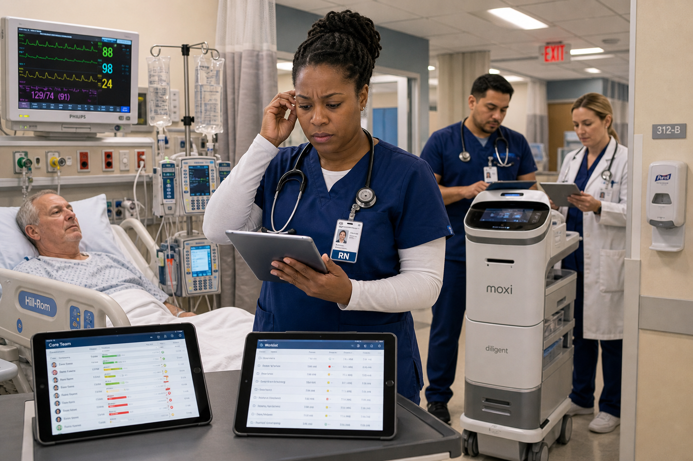
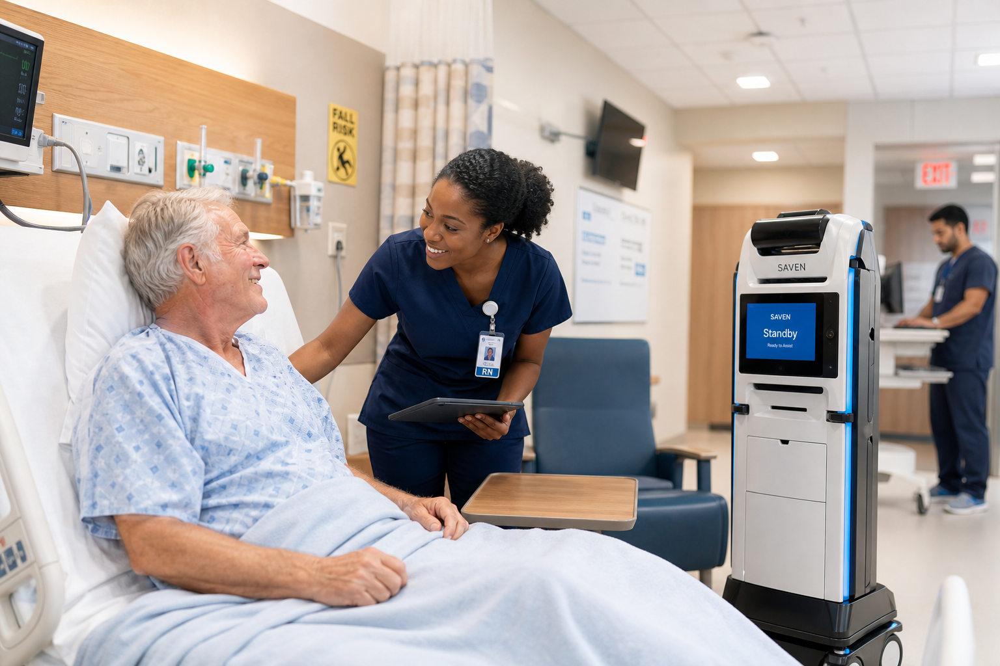
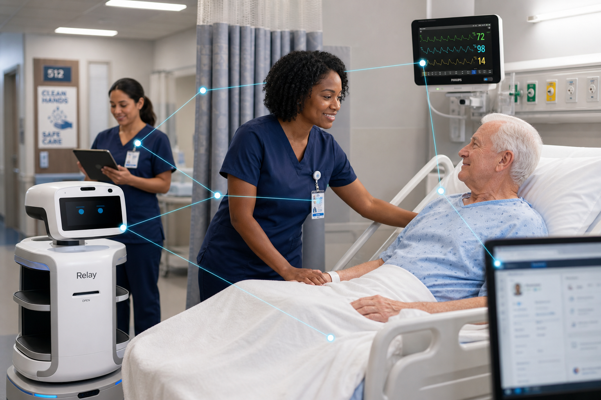
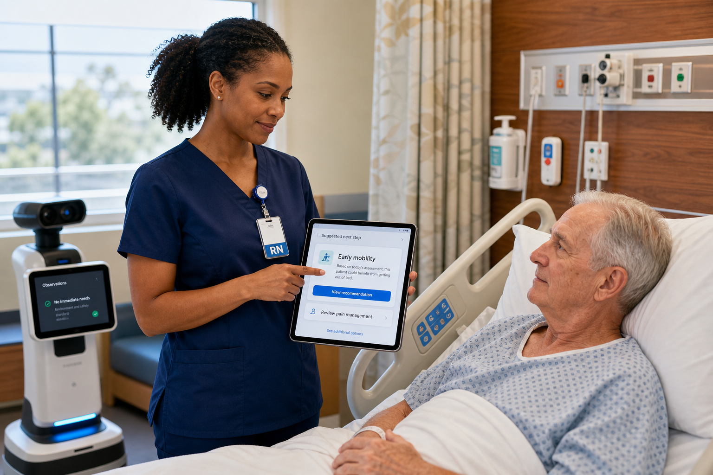
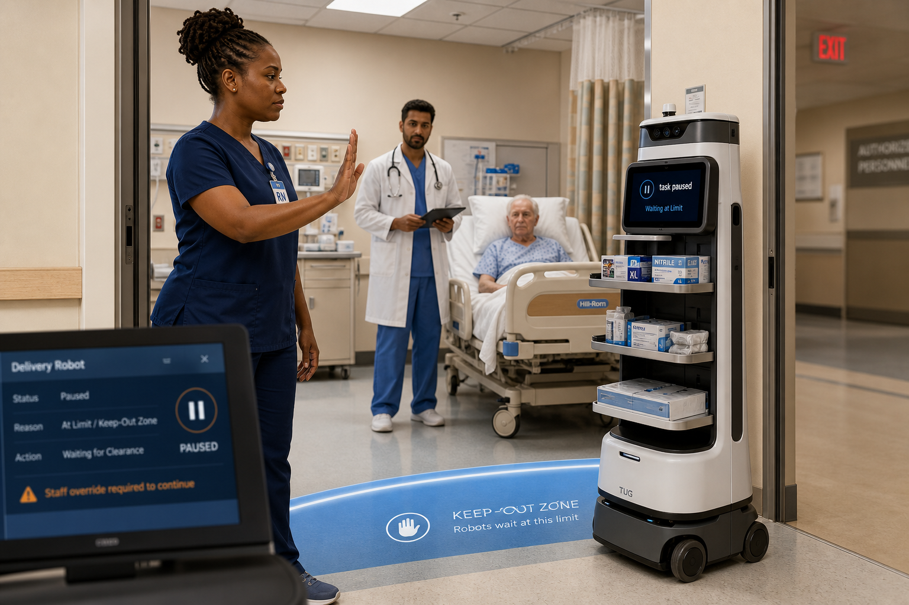
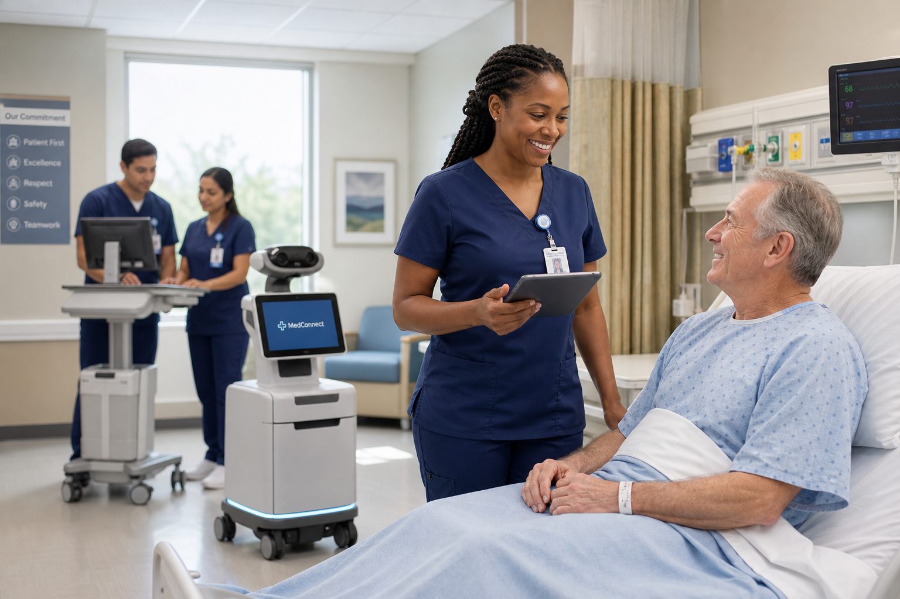

# One Human Hour — Website storyboard (Direction B)

**Form:** Product website frames — not cinema.  
**Meaning:** Intelligent robotics for human care (owner purpose north star).  
**Setting:** Contemporary **American hospital** (US clinical environment) — patient rooms with US headwalls / gas outlets, privacy curtains, drop ceilings, American EXIT / room / FALL RISK environmental cues (may be soft-focus), US equipment vernacular (beds, monitors, IV pumps), American scrub / badge-reel culture. Not East Asian / Chinese hospital aesthetics.  
**Cast:** Black woman nurse (lead, continuous across all six) · White/European male patient (continuous) · Latino / South Asian / Middle Eastern / White colleagues in supporting roles · utilitarian assistive hospital robot + devices visible early. American-diverse faces — not an all-East-Asian cast.  
**SAVEN on screen as:** assistance robotics working alongside people in care — never a logo hero.  
**Delivery:** bright product-website frames (instant read), not film lighting.

**Purpose framing (on-site preview):** First viewport states what SAVEN Robotics Lab creates and what it is for — recover, confidence, independence; understand movement; rehab support; assist clinicians & families. The hospital hour is **visual proof of care**, not an architecture-wiki metaphor. Closing energy: *Turning Intelligence Into Human Care.*

Readable from the first second: *care under pressure → understand movement → meaningful care → alongside clinicians → clear human limits → next step with dignity.*

| # | Frame | Line (website caption) |
|---|---|---|
| 01 |  | Care under pressure: people need help standing, walking, recovering — and every signal competes. |
| 02 |  | SAVEN is designed to understand movement — what the human body is trying to say. |
| 03 |  | Sensors, AI, and real-time analysis turn data into meaningful care. |
| 04 |  | Working alongside doctors, nurses, and therapists — assistance informs; people decide. |
| 05 |  | Clear limits stay clear — robotics assists; dignity and control stay human. |
| 06 |  | Helping someone take the next step — recovery with confidence, dignity, and compassion. |

**10s path:** 01 → 02 → 03  
**60s path:** all six  
**Older film-style frames** (`hour-01` … `hour-06`) kept for reference; **web-01 … web-06** are the active website direction.

**On-site preview (for owner review):** [http://127.0.0.1:3000/en/preview/human-hour/](http://127.0.0.1:3000/en/preview/human-hour/)  
Static assets served from `public/storyboard/human-hour/`.
